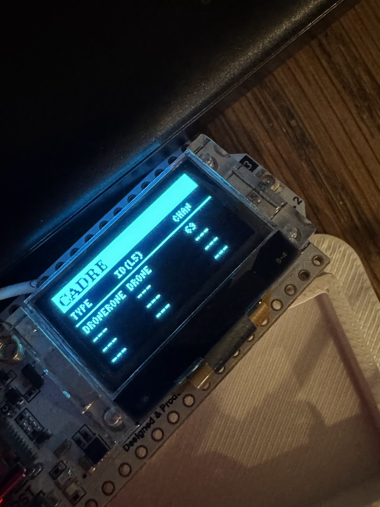

```
 ░▒▓██████▓▒░ ░▒▓██████▓▒░░▒▓███████▓▒░░▒▓███████▓▒░░▒▓████████▓▒░ 
░▒▓█▓▒░░▒▓█▓▒░▒▓█▓▒░░▒▓█▓▒░▒▓█▓▒░░▒▓█▓▒░▒▓█▓▒░░▒▓█▓▒░▒▓█▓▒░        
░▒▓█▓▒░      ░▒▓█▓▒░░▒▓█▓▒░▒▓█▓▒░░▒▓█▓▒░▒▓█▓▒░░▒▓█▓▒░▒▓█▓▒░        
░▒▓█▓▒░      ░▒▓████████▓▒░▒▓█▓▒░░▒▓█▓▒░▒▓███████▓▒░░▒▓██████▓▒░   
░▒▓█▓▒░      ░▒▓█▓▒░░▒▓█▓▒░▒▓█▓▒░░▒▓█▓▒░▒▓█▓▒░░▒▓█▓▒░▒▓█▓▒░        
░▒▓█▓▒░░▒▓█▓▒░▒▓█▓▒░░▒▓█▓▒░▒▓█▓▒░░▒▓█▓▒░▒▓█▓▒░░▒▓█▓▒░▒▓█▓▒░        
 ░▒▓██████▓▒░░▒▓█▓▒░░▒▓█▓▒░▒▓███████▓▒░░▒▓█▓▒░░▒▓█▓▒░▒▓████████▓▒░ 

Civilian-Available Drone REcon
```

### Disclaimer
The following program is intended for research purposes **only**. The situations described are fictional in nature and only used as examples. As the MIT license states:

> THE SOFTWARE IS PROVIDED “AS IS”, WITHOUT WARRANTY OF ANY KIND, EXPRESS OR IMPLIED, INCLUDING BUT NOT LIMITED TO THE WARRANTIES OF MERCHANTABILITY, FITNESS FOR A PARTICULAR PURPOSE AND NONINFRINGEMENT. IN NO EVENT SHALL THE AUTHORS OR COPYRIGHT HOLDERS BE LIABLE FOR ANY CLAIM, DAMAGES OR OTHER LIABILITY, WHETHER IN AN ACTION OF CONTRACT, TORT OR OTHERWISE, ARISING FROM, OUT OF OR IN CONNECTION WITH THE SOFTWARE OR THE USE OR OTHER DEALINGS IN THE SOFTWARE.

**Using this software in an unlicensed, unauthorized way can put you in prison. Don't do it.**

# Rationale
As of 2026, ongoing conflicts have showed that when the lack of military hardware is available, state and nonstate actors will turn to civilian, off-the-shelf (COTS) hardware. The Myanmar Civil War \[1\], Russo-Ukrainian conflict, and -- to a lesser degree -- Syrian Civil War \[3\] and outspringing conflicts have all used commercially available drones for mission-built purposes.

Because necessity is the mother of invention, both military-industrial grade and battlefield made countermeasures have been used successfully to stop drones. [The Ukranian Chuyka](https://www.blue-bird.tech/en/products/chuyka-3-0/) is a valuable piece of tech for front line troops, allowing them to eavesdrop on unecrypted, analog video of loitering drones. However, it's a piece of tech that's almost $2,000 here in the United States. There are other drone detection hardware devices of varying quality [littered across eBay](https://www.ebay.com/itm/376574536302). Inspired by Colonel Panic's [Drone Mesh Mapper](https://github.com/colonelpanichacks/drone-mesh-mapper) and [DroneAware.io](https://droneaware.io/), this project is an exploration of what technologies could be used in a cheap, open, and commercially-available way to detect a hypothetical drone incursion.

The scope of this research is limited to the 2.4GHZ and 5.8GHZ bands that some commercially-available drones use for controls, phone-home, or analog/digital video signals. This is not intended for fiber optic, special-frequency, industrial, or other drone types. There is no warranty provided and the authors of this project shall not be held liable for any part in the use of this project.



# Layout
This project is laid out as 3 distinct folders: Hardware, firmware, and docs.

## Hardware
Here you'll find the .STL for printing the sled to affix the boards to. This will also contain links to the hardware needed for this project.

## Firmware
This folder will contain the firmware for the hub and each spoke. This project assumes you have had some experience with microcontrollers, but a platformio.ini is included for each of the ESP32 boards.

## Docs
This will eventually contain a step-by-step guide for how to wire the project, but for now, it's empty. This project accepts pull requests, but documentation needs to be written for humans, by humans.


# Bill of Materials
| **Part** | **Cost** | **Source** |
| --- | --- | --- |
| ESP32S3 (2.4ghz node) | $7.99 | [Seeed Studio](https://www.seeedstudio.com/Seeed-Studio-XIAO-ESP32S3-Plus-p-6361.html) |
| BW16 IPEX (5.8ghz node) | $10.77 | [AliExpress](https://www.aliexpress.us/item/3256810605716193.html) |
| Heltec V3 (hub) | $25.00 | [Amazon](https://www.amazon.com/AYWHP-Development-Meshtastic-Bluetooth-863-928MHz/dp/B0DMN28TRW/ref=sr_1_3) |
| USB-A to 3x USB-C splitter | $7.98 | [Amazon](https://www.amazon.com/dp/B09WRBK8HD) |
| 5.8ghz antenna | $18.47 | [Amazon](https://www.amazon.com/dp/B0GL7QSNNK) |
| USB Power bank | $16.99 | [Amazon](https://www.amazon.com/dp/B0FGDCY95C) |


**Considerations**

- The listed antenna is purpose-built for drone application, but any antenna for 2.4ghz and 5.8ghz will suffice.

- For power banks, the listed USB power bank is sufficient for 12+ hours of use, but any USB power bank will work.

- If you choose to forego the 3-pronged USB and wire the boards a different way, they will need a shared ground wire.

# Wiring
Because each board is only responsible for transmitting when it finds a specific piece of data, the wiring is extremely pared back.

| **From ESP32S3** | **To HeltecV3** |
| --- | --- |
| D7 (GPIO44) | Pin 7 (GPIO42) |


| **From BW16** | **To HeltecV3** |
| --- | --- |
| PA7 (LOG_TX) | Pin 8 (GPIO41) |

---
1. ["An Inside View into Drone Warfare in Myanmar."](https://www.geopoliticalmonitor.com/an-inside-view-into-drone-warfare-in-myanmar/) February 21, 2025.
2. ["Eyewitness to war: Ukraine’s DIY drones defy Russian jamming."](https://www.gisreportsonline.com/r/ukraine-diy-drones/) May 4, 2026.
3. ["The Drones of Hayat Tahrir al-Sham: The Development and Use of UAS in Syria."](https://gnet-research.org/2024/12/20/the-drones-of-hayat-tahrir-al-sham-the-development-and-use-of-uas-in-syria/) December 20, 2024. 