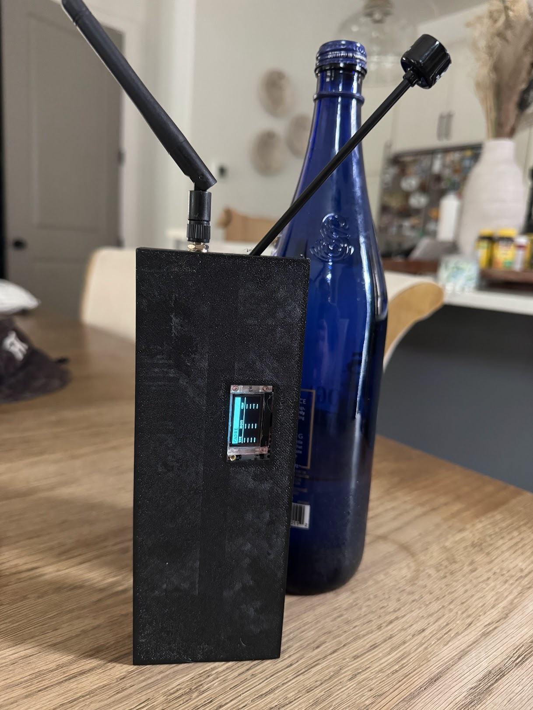

```
 ░▒▓██████▓▒░ ░▒▓██████▓▒░░▒▓███████▓▒░░▒▓███████▓▒░░▒▓████████▓▒░ 
░▒▓█▓▒░░▒▓█▓▒░▒▓█▓▒░░▒▓█▓▒░▒▓█▓▒░░▒▓█▓▒░▒▓█▓▒░░▒▓█▓▒░▒▓█▓▒░        
░▒▓█▓▒░      ░▒▓█▓▒░░▒▓█▓▒░▒▓█▓▒░░▒▓█▓▒░▒▓█▓▒░░▒▓█▓▒░▒▓█▓▒░        
░▒▓█▓▒░      ░▒▓████████▓▒░▒▓█▓▒░░▒▓█▓▒░▒▓███████▓▒░░▒▓██████▓▒░   
░▒▓█▓▒░      ░▒▓█▓▒░░▒▓█▓▒░▒▓█▓▒░░▒▓█▓▒░▒▓█▓▒░░▒▓█▓▒░▒▓█▓▒░        
░▒▓█▓▒░░▒▓█▓▒░▒▓█▓▒░░▒▓█▓▒░▒▓█▓▒░░▒▓█▓▒░▒▓█▓▒░░▒▓█▓▒░▒▓█▓▒░        
 ░▒▓██████▓▒░░▒▓█▓▒░░▒▓█▓▒░▒▓███████▓▒░░▒▓█▓▒░░▒▓█▓▒░▒▓████████▓▒░ 

Civilian-Available Drone REcon
```

# Enclosure


With the 8/26 update, I've added an enclosure that can be printed and snapped together to hold the pieces. I used double sided adhesive tape to tape the chips face-down (so that the bottom of the chip can vent out of the back of the case).

It's just a big empty case, but maybe some of y'all are better at running wires than me.

# Bill of Materials

| **Part** | **Cost** | **Source** |
| --- | --- | ---|
| ESP32S3 (2.4ghz node) | $7.99 | [Seeed Studio](https://www.seeedstudio.com/Seeed-Studio-XIAO-ESP32S3-Plus-p-6361.html) |
| BW16 IPEX (5.8ghz node) | $10.77 | [AliExpress](https://www.aliexpress.us/item/3256810605716193.html) |
| Heltec V3 (hub) | $25.00 | [Amazon](https://www.amazon.com/AYWHP-Development-Meshtastic-Bluetooth-863-928MHz/dp/B0DMN28TRW/ref=sr_1_3) |
| USB-A to 3x USB-C splitter | $7.98 | [Amazon](https://www.amazon.com/dp/B09WRBK8HD) |
| 5.8ghz antenna | $18.47 | [Amazon](https://www.amazon.com/dp/B0GL7QSNNK) |
| USB Power bank | $16.99 | [Amazon](https://www.amazon.com/dp/B0FGDCY95C) |

Antennas, power banks, and USB splitters are all optional if you have you own or want to power the boards a different way. All boards need to share a common ground, and a single USB cable was a way to simplify that.

# Wiring

Because each board is only responsible for transmitting when it finds a specific piece of data, the wiring is extremely pared back.

| **From ESP32S3** | **To HeltecV3** |
| --- | --- |
| D7 (GPIO44) | Pin 7 (GPIO42) |


| **From BW16** | **To HeltecV3** |
| --- | --- |
| PA7 (LOG_TX) | Pin 8 (GPIO41) |

